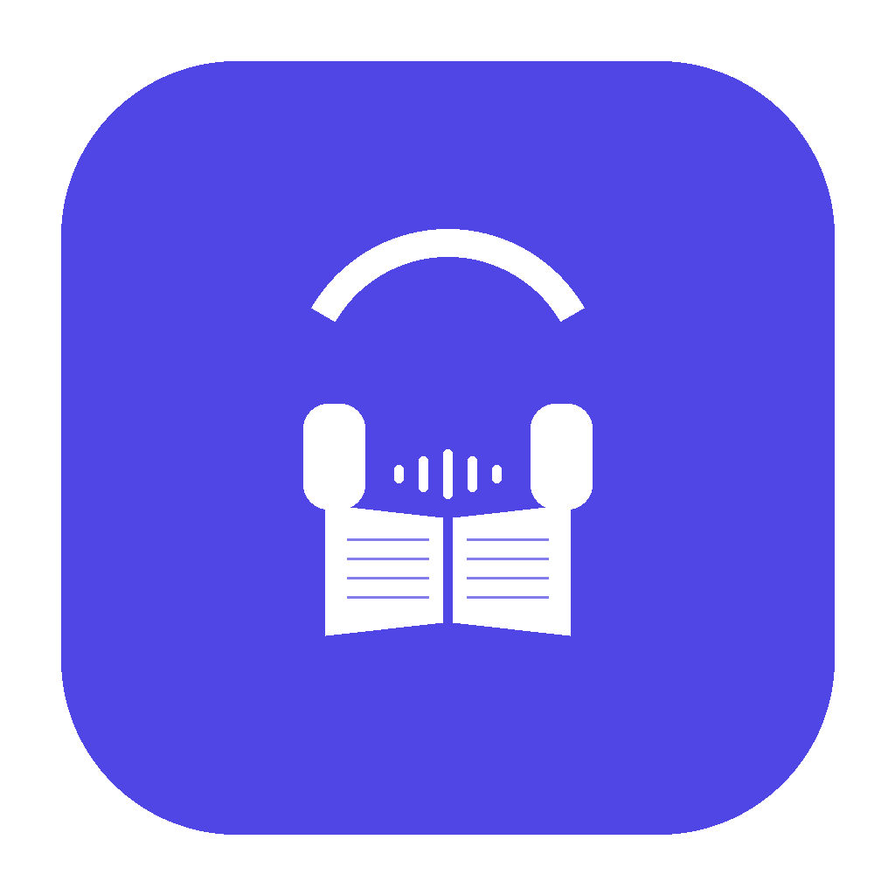

<p align="center">
  
</p>

<h1 align="center">Lession</h1>

<p align="center">A headless lessons publishing system.</p>

Lession is a desktop app that helps you manage, transcribe, and publish educational audio/video content to any S3-compatible storage. It doesn't bind to any specific platform — instead, it produces a standardized data structure (based on [JSON Feed 1.1](https://www.jsonfeed.org/version/1.1/)) that any frontend application can consume.

## How It Works

Lession uploads structured data to S3 following a well-defined convention:

```
series/
  index.json                        # Catalog of all published series
  {seriesId}/
    feed.json                       # JSON Feed 1.1 — series metadata + episode list
    cover.{ext}                     # Cover image
    episodes/
      {episodeId}/
        media.{ext}                 # Audio/video file
        transcript.json             # Word-level transcript with timing
        subtitle.srt                # SRT subtitles
        subtitle.vtt                # VTT subtitles
```

Any app — a website, a mobile app, or a podcast player — can read `index.json` to discover content, fetch `feed.json` for series details, and stream media with full transcript and subtitle support.

## Features

- **Series & Episodes** — Organize content as courses, podcasts, audiobooks, or video series
- **Media Import** — Download from URLs (via yt-dlp) or import local files
- **Waveform Splitting** — Visual editor with silence detection for splitting long recordings into episodes
- **Transcription** — Word-level speech-to-text via WhisperX (local) or Replicate (cloud)
- **NLP Analysis** — POS tagging, phrase chunking, and named entity recognition via spaCy
- **Publishing** — Draft → Preview → Published workflow; generates JSON Feed + subtitles and uploads to S3

## Install

### macOS (Homebrew)

```bash
brew install --cask eslsoft/tap/lession
```

### macOS / Windows (Manual)

Download the latest installer from [GitHub Releases](https://github.com/eslsoft/lession/releases):

- **macOS**: `.dmg` file
- **Windows**: `.exe` installer

### External Dependencies

Lession relies on external tools for media processing and transcription. Install the ones you need:

| Tool | Purpose | Install |
|------|---------|---------|
| [ffmpeg](https://ffmpeg.org) | Media processing & waveform extraction | `brew install ffmpeg` |
| [yt-dlp](https://github.com/yt-dlp/yt-dlp) | Download media from URLs | `brew install yt-dlp` |
| [WhisperX](https://github.com/m-bain/whisperX) | Local speech-to-text | `pip install whisperx` |
| [uv](https://github.com/astral-sh/uv) + [spaCy](https://spacy.io) | NLP analysis | `pip install uv` |

> You can use the **Replicate** cloud API for transcription instead of local WhisperX — configure it in Settings.

## Quick Start

1. Launch Lession and complete the **Setup** wizard (S3 credentials, transcription provider, tool paths)
2. Create a **Series** (e.g., "English Podcast")
3. Import media — paste a URL or import a local file
4. Optionally **split** long recordings using the waveform editor
5. **Transcribe** episodes with one click
6. **Publish** to S3 — Lession generates the JSON Feed, subtitles, and uploads everything

## Contributing

See [CONTRIBUTING.md](CONTRIBUTING.md).

## Tech Stack

Electron · React · TypeScript · Vite · Tailwind CSS · SQLite · Zustand

## License

[Apache License 2.0](LICENSE)
